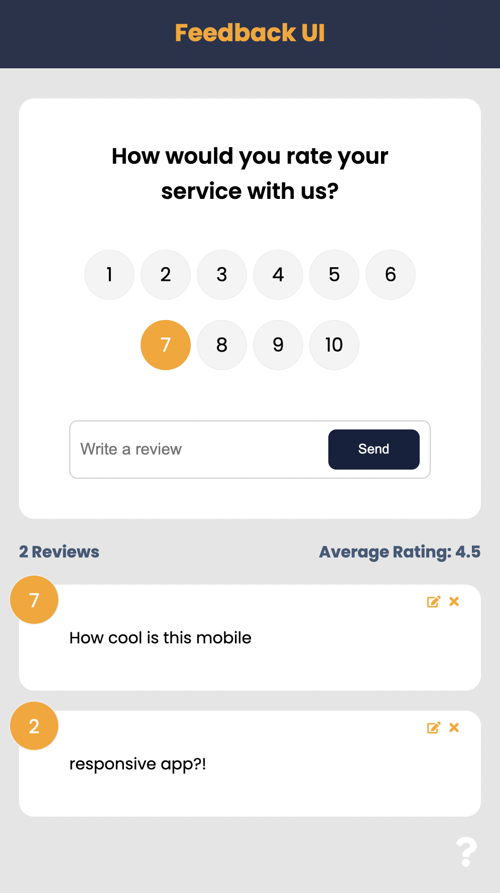
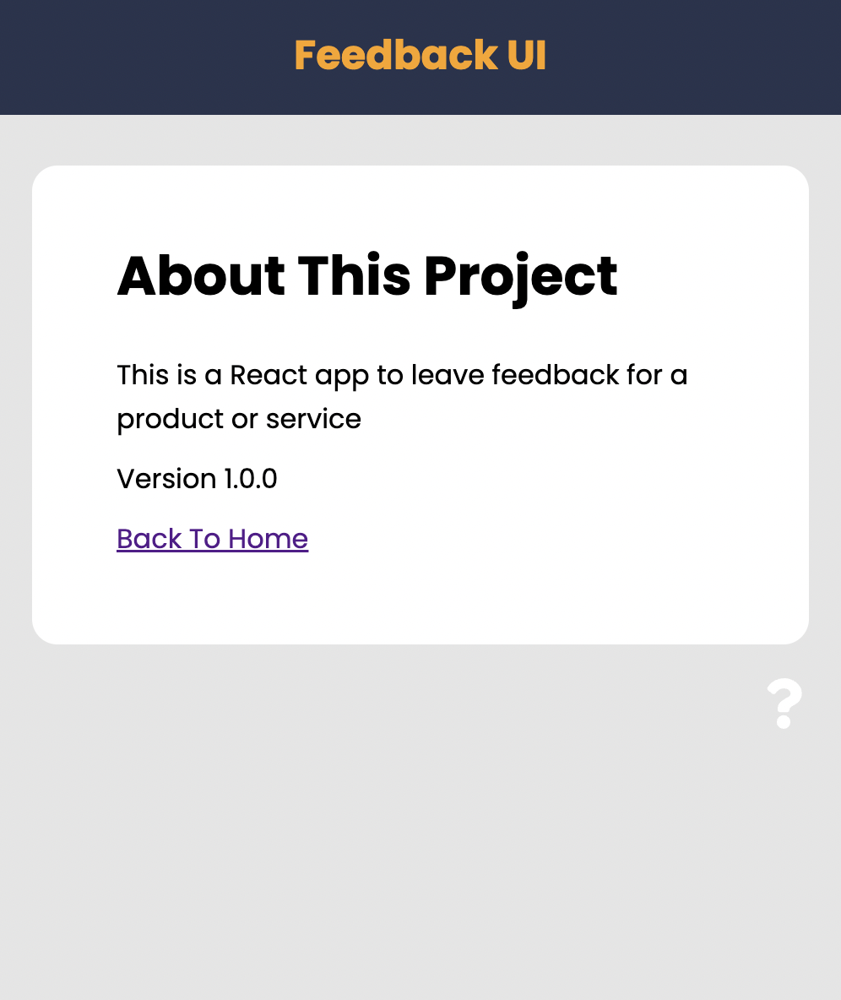

  

<h1 align="center">Feedback app</h1>

## Description

Feedback app is a tool for customers to leave their feedback. The user's feedback will be submitted along with a rating from 1 to 10. This application uses JSON-server for a mock backend.

## Built With

- ReactJS
- React-Router
- JSON-server

## Website

Visit [Feedback app](https://phenomenal-frangipane-4aa899.netlify.app/).

 

 

## Contribution

Made with ❤️ by Nicole Barranca

## Questions

Feel free to contact me directly at nikkibarranca@gmail.com if you have any questions about the repo.

You can find more of my work at [Nicole Barranca](https://github.com/NicoleBarranca).
